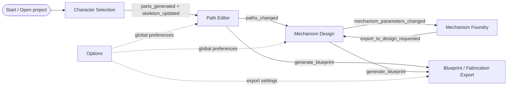

# Platform Rebuild UI/UX Porting Flow (Historical)

Archived historical evidence. Qt→web/platform rebuild. Preserves prior workflow mapping + implementation context for provenance/audit. Implementation authority now in current product contracts.

Use when goal = total rebuild, not small Qt refactor. New platform may be web, native desktop, tablet, or hybrid — but must preserve same user promises:

- users load/choose character, edit skeleton/parts, draw motion paths;
- users explore + tune mechanisms separate from character;
- mechanisms attach to character parts, no screen-to-screen drift;
- visual handles, numeric params, animation, blueprint output stay 1:1;
- fabrication export reflects actual board, character, mechanism count + placement, not generic recipe.

## 1. Product mental model

Automataii = three nested products in one app:

1. **Character authoring**: image → movable body parts + skeleton.
2. **Motion authoring**: define how body parts move, then attach mechanisms producing motion.
3. **Fabrication authoring**: convert scene into printable/cuttable parts + assembly guide for physical kit.

Rebuild exposes products as staged workflow. Underlying state shared + inspectable.

## 2. Current screen map

Legacy Qt app created these workflow surfaces in `src/automataii/presentation/qt/main_window.py`:

| Order | Current object | User-facing name | Rebuild responsibility |
| --- | --- | --- | --- |
| 1 | `ImageProcessingTab` / `tab_character_selection` | Character Selection | Choose sample/image, run segmentation/BPE, emit parts + skeleton. |
| 2 | `EditorTab` / `tab_path_editor` | Path Editor | Arrange parts, edit skeleton, draw motion paths, preview IK motion. |
| 3 | `MechanismDesignTab` / `tab_mechanism_design` | Mechanism Design | Attach mechanisms to paths/parts, parametric-edit, preview animation. |
| 4 | `MechanismFoundryView` / `tab_mechanism_foundry` | Mechanism Foundry | Explore mechanism families, tune recipes, export selected mechanism into design. |
| Menu/dialog | `OptionsTab` / `tab_options` | Options | Global animation timing, theme, toolbar, blueprint format, autosave, panel visibility. |
| Export flow | Blueprint/exporter classes | Blueprint package | Current-scene printable/fabrication output + assembly instructions. |

Don't rebuild old `MainWindow` as another god object. Treat as orchestration map: shows which events exist today + which state each screen expects.

## 3. Architecture to preserve

Keep clean architecture boundary. New UI can rewrite completely, but consume same concepts.

| Layer | Preserve as | Must not depend on |
| --- | --- | --- |
| Domain | Pure mechanism, skeleton, animation, geometry computation. | UI toolkit, canvas, filesystem dialogs. |
| Application | Use cases, managers, state models, adapters, validation. | Specific widget classes in new platform. |
| Presentation | Screens, canvas, handles, drag/drop, dialogs, visual feedback. | Hidden business rules that live in application/domain. |
| Infrastructure | persistence, export generation, event bus, validation adapters. | Screen-local state assumptions. |
| Shared | `Result`, `Point2D`, physical-kit constants, fabrication contracts. | Toolkit-specific types. |

### Rebuild rule

Port headless contracts first, then UI. Successful rebuild runs these flows without rendering UI:

1. load `parts_info.json`, `char_cfg.yaml`, + assets;
2. normalize character to target print sheet;
3. transform skeleton, path, + mechanism coords through one scene frame;
4. create/update mechanism from parameters;
5. export fabrication package from current design state.

## 4. Canonical state owners

Rebuild collapses cross-screen data into explicit app state store. Current Qt code already has partial single source of truth via `ProjectStateManager`; use as model, avoid screen-local duplicates.

| State | Current owner | Rebuild owner | Notes |
| --- | --- | --- | --- |
| Raw project files + directories | `ProjectDataManager` | Project loader service | Knows where `parts_info.json`, `char_cfg.yaml`, masks, part assets live. |
| Cross-tab project state | `ProjectStateManager` | Global state store | Immutable-style state: parts, skeleton, paths, mechanisms, metadata. |
| Standard skeleton | `SkeletonManager` | Skeleton service/slice | Converts Animated Drawings data → app skeleton format. |
| IK animation runtime | `IKManager` + editor handlers | Animation service | Runtime-only; not persistence source. |
| Part/path editing scene | `EditorTab` + `EditorTabAdapter` | Editor feature module | Emits paths + part/skeleton edits as state actions. |
| Mechanism layer scene | `MechanismDesignTab` + adapter | Mechanism design feature module | Uses state mechanisms + paths; owns only transient selection/drag state. |
| Foundry exploration state | `MechanismFoundryController/View` | Foundry feature module | Design-time recipes + previews; exports mechanism spec. |
| Fabrication output | blueprint/export services | Export service | Reads current state only; never guesses generic placement. |
| Physical kit profile | `PhysicalKitContext`, `physical_kit.py` | App settings + shared constants | 2 cm grid + Letter sheet assumptions must be explicit. |

## 5. Data contracts required by every platform

### 5.1 Character project package

Character package = output of Character Selection, input to every other screen.

Required files + fields:

- `parts_info.json`
  - part id/name;
  - `texture_path` or legacy `image_path`;
  - `mask_path` when available;
  - `anchor_joint`;
  - transform: `x`, `y`, `rotation`, `scale`;
  - `z_index`, opacity, fixed/visibility-like flags;
  - optional ROI/bounding box + effective bbox offsets;
  - optional original/enhanced SVG paths;
  - optional `local_pivot_offset`.
- `char_cfg.yaml`
  - Animated Drawings-style skeleton source;
  - joints, hierarchy/root ids, limb lengths, source metadata.
- `mask.png`
  - whole-character mask if generated.
- part assets
  - individual PNG/SVG body parts referenced by `parts_info.json`.

Load-time UX requirements:

- show clear stage: selecting, processing, loading, normalizing, ready;
- if `char_cfg.yaml` or `parts_info.json` missing, block with recoverable error + file path;
- normalize to configured print sheet before editing;
- don't preserve old dummy mechanisms during plain image load; preserve/rebind only during explicit dummy replacement.

### 5.2 Standardized skeleton

App-wide skeleton represented independent from source file.

Minimum fields:

- `joints`: keyed by joint id, x/y position, display name, parent id, lock state, + `bend_direction` defaulting `1.0` if absent;
- `bones`: ordered joint id pairs;
- `root_joint` or `root_joint_ids`;
- `joint_map`: semantic name → id;
- `hierarchy`: parent id → child id list;
- `metadata`: source format, scale, image bounds, + normalization info.

UX requirements:

- skeleton visuals match between Path Editor + Mechanism Design;
- adding/removing joints updates hierarchy + body-part anchors atomically;
- missing optional fields must not crash rendering;
- locked joints + bend direction visible + editable.

### 5.3 Body part/layer data

Body part = both visual layer + semantic animation target.

Minimum fields:

- stable id/name;
- asset references;
- transform in canonical scene coords;
- local pivot/anchor offset;
- z/layer order;
- associated skeleton joint;
- hit-test region or rendered bounds;
- visibility/lock/selectability;
- optional group/semantic role.

UX requirements:

- users add/remove/reorder layers;
- users define or reassign body parts directly;
- changing part anchor updates skeleton relationship + animation preview;
- part positions shown in editor = positions used by mechanisms + exports.

### 5.4 Motion path data

Path data flows from Path Editor into Mechanism Design.

Minimum fields:

- `part_name` or stable part id;
- ordered points in canonical scene coords;
- optional timed points: x/y/time;
- total duration;
- closed/open flag;
- enabled flag;
- source metadata: drawn by user, generated by mechanism, imported.

UX requirements:

- path visibility toggleable without deleting data;
- paths appear in Mechanism Design at same location as Path Editor;
- path edits emit one state action + update all subscribers;
- invalid/too-short paths show warnings, not silent failure.

### 5.5 Mechanism data

Mechanism layer = instance, not type bucket. Two four-bar mechanisms export as two separate instances.

Minimum fields:

- stable mechanism id;
- mechanism type/canonical type, e.g. `four_bar`, `4_bar_linkage`, `cam`, `gear`, `planetary_gear`;
- target `part_name` or body-part ids;
- parameters + real-world parameters;
- key points in canonical scene coords;
- transform + scene anchor;
- active visual part ids;
- generated output path if available;
- Foundry snapshot/source metadata if exported from Foundry;
- fabrication metadata: board coords, grid pitch, required parts, validation warnings;
- enabled/visible state.

UX requirements:

- drag handles + numeric params update each other 1:1;
- parametric-editing overlays cleaned up when leaving edit mode;
- during editing, prefer rough animation feasibility + warnings over strict physical rejection;
- strict validation belongs at fabrication/export time;
- if mechanism only rotates through safe partial range, show that angle range, don't pretend 360 degrees.

### 5.6 Foundry export package

Foundry = mechanism sandbox. Exports recipe into character design.

Minimum fields:

- mechanism id or generated instance id;
- mechanism type;
- parameter map;
- selected output/pivot point;
- generated path points + simulation summary when available;
- visual config: pivot point, scale, color scheme, constraints visible;
- animation config: duration, steps, loop flag;
- metadata: source tab, timestamp, selected preset/recommendation, warnings.

UX requirements:

- Foundry export asks where mechanism lands only when target can't be inferred;
- if exported to Mechanism Design, first rendered position must match Foundry preview anchor;
- bidirectional parameter sync never overwrites unrelated mechanism with same type.

### 5.7 Blueprint/fabrication package

Blueprint export reads current design state + generates physical output. Must not create generic one-of-each mechanism guide.

Minimum output concepts:

- current scene snapshot;
- one fabrication recipe per mechanism instance;
- board coords in declared origin frame;
- grid pitch, sheet size, hole diameter, physical profile key;
- required parts/cut list + quantities;
- assembly steps with coordinate roles + visual highlights;
- printable PDFs/SVGs for kit parts + assembly guide;
- machine-readable metadata for future import/debugging.

Current physical assumptions to make explicit in new platform:

- default grid pitch: 20 mm / 2 cm;
- Letter page: 8.5 in x 11 in, or 215.9 mm x 279.4 mm;
- default board: 15 x 15 cells;
- board label frame: A1 top-left for SVG/manual pages;
- app-centered frame: H8 at origin for scene/board-centered calculations.

## 6. Screen-by-screen rebuild specification

### 6.1 Character Selection

**User goal:** choose sample character or load image + convert into riggable character package.

**Entry condition:** app has no character, existing project open, or user chooses to replace current character.

**Required inputs:** source image or sample id; processing settings; optional replacement context.

**Primary actions:**

1. choose sample/load image;
2. run image processing/segmentation;
3. review generated parts + skeleton;
4. accept or fix skeleton/part detection;
5. emit `parts_generated(annotation_results, final_output_dir)`;
6. emit `skeleton_updated(raw_skeleton_data)` when skeleton changes.

**State updates:**

- write/copy `parts_info.json`, `char_cfg.yaml`, `mask.png`, part assets;
- load project package into project state;
- normalize character to print sheet;
- update standardized skeleton;
- clear stale editor/mechanism caches unless explicit replacement.

**Exit transitions:**

- success: go to Path Editor;
- processing failure: remain here with recoverable error;
- replacement success: go to previous workflow stage with rebinding summary.

**Porting notes:**

- keep processing progress visible;
- preserve distinction between plain image load + dummy-character replacement;
- don't let image-processing output become screen-local only.

### 6.2 Path Editor

**User goal:** make character editable, align skeleton/parts, draw paths, preview body motion.

**Entry condition:** project has parts + standardized skeleton.

**Required inputs:** parts, skeleton, current global settings, optional existing paths.

**Primary actions:**

1. select/move/rotate/scale body parts;
2. add/remove/edit skeleton joints;
3. define/reassign body-part anchors;
4. add/remove/reorder visual layers;
5. draw or edit paths on parts;
6. play/stop/reset simulation;
7. save alignment;
8. request blueprint export.

**State updates:**

- part transforms + layer order;
- skeleton joints, hierarchy, locks, bend directions;
- path data per part;
- alignment metadata.

**Exit transitions:**

- to Mechanism Design once paths or target parts exist;
- to Blueprint export when user requests fabrication output;
- back to Character Selection if reprocessing/replacement needed.

**Porting notes:**

- editor canvas = canonical coordinate reference for parts/skeleton;
- one 2 cm grid renderer shared with Mechanism Design + export previews;
- body parts stay in convenient editable location after sheet normalization, not hidden at arbitrary origin;
- simulation visuals must not mutate persistent part/skeleton data unless user explicitly saves alignment.

### 6.3 Mechanism Foundry

**User goal:** explore mechanisms independently, understand motion, send selected recipe into character design.

**Entry condition:** app can run without character, but export-to-design works best when character/project active.

**Required inputs:** mechanism family, preset/recommendation, parameter values, physical-kit profile.

**Primary actions:**

1. choose mechanism family: four-bar/linkage, cam-follower, gear, planetary gear;
2. pick preset or recommendation;
3. drag/edit parameters;
4. preview generated path + constraints;
5. inspect feasibility warnings;
6. export selected mechanism to Mechanism Design.

**State updates:**

- Foundry-local preview parameters;
- optional synchronized mechanism parameters if editing exported instance;
- export package on handoff.

**Exit transitions:**

- export creates or updates one mechanism instance in Mechanism Design;
- failed feasibility remains in Foundry with warnings + editable params.

**Porting notes:**

- recommendation dialogs use same permissive edit-time feasibility rules as parametric editing;
- four-bar range display shows actual safe partial rotation when 360-degree motion not feasible;
- don't collapse multiple same-type mechanisms into one export item.

### 6.4 Mechanism Design

**User goal:** attach mechanisms to character parts/paths, edit directly, preview motion, send final design to fabrication.

**Entry condition:** project has character parts; paths optional but visible if present.

**Required inputs:** parts, skeleton, path data, mechanism instances, physical-kit settings, optional Foundry export package.

**Primary actions:**

1. add mechanism manually or from Foundry;
2. choose target part/path/anchor;
3. drag mechanism into place;
4. enter parametric editing mode;
5. edit handles + numeric fields;
6. preview animation;
7. remove/disable mechanism;
8. request blueprint export.

**State updates:**

- one mechanism instance per layer;
- parameter map + key points;
- target part/path mapping;
- generated path or output motion;
- validation warnings;
- transient selection/drag state only in UI module.

**Exit transitions:**

- to Foundry for deeper mechanism exploration;
- to Blueprint export for fabrication;
- to Path Editor when source paths or skeleton/part anchors need fixing.

**Porting notes:**

- all displayed handles generated from same mechanism state that is persisted + exported;
- handle drag lifecycle: start from current state, preview local change, commit state action, re-render from state;
- stale edit handles removed on mode exit, mechanism selection change, character reload, + mechanism deletion;
- screen position, board position, + export position use one transform pipeline;
- strict fabrication constraints should not block rough animation layout.

### 6.5 Options

**User goal:** tune global behavior without losing current work.

**Required settings:**

- animation duration;
- timing profile;
- theme;
- toolbar visibility;
- part properties panel visibility;
- autosave settings;
- blueprint/export format;
- physical-kit profile + grid pitch when exposed.

**Porting notes:**

- settings app-global + observable by all screens;
- changing grid pitch updates editor grid, mechanism grid, + blueprint export together;
- settings changes must not mutate project data unless explicitly saved as project metadata.

### 6.6 Blueprint / Fabrication Export

**User goal:** obtain printable + machine-readable instructions matching current design.

**Entry condition:** current project has ≥1 character or mechanism; full fabrication output needs mechanism instances with enough placement data.

**Required inputs:** project state, mechanism instances, physical-kit settings, export format, output directory.

**Primary actions:**

1. validate current design for export;
2. show warnings/errors with mechanism ids + screen links;
3. compose per-instance fabrication recipes;
4. generate board assembly steps;
5. generate PDFs/SVGs + metadata files;
6. open output folder or show package summary.

**Porting notes:**

- warnings specific: mechanism id, part, missing coordinate, incompatible gear/link length, out-of-sheet element;
- duplicate mechanism types remain distinct instances;
- board coords reflect scene placement + chosen grid pitch;
- export includes enough metadata to reload or debug fabrication state.

## 7. Cross-screen event/action contract

Use actions/events like these in new state store. Names can change, semantics must not.

| Event/action | Producer | Consumers | Payload |
| --- | --- | --- | --- |
| `parts_generated` | Character Selection | project loader, Editor, Mechanism Design | annotation results + output directory. |
| `skeleton_updated` | Character Selection or Editor | Skeleton service, Editor, Mechanism Design | raw or standardized skeleton data. |
| `parts_changed` | project state | Editor, Mechanism Design, export | map of body parts. |
| `skeleton_changed` | project state | Editor, Mechanism Design, IK runtime | standardized skeleton. |
| `path_data_changed` | Editor | project state | map of part → path. |
| `motion_path_updated` | Editor | project state | one part path. |
| `paths_changed` | project state | Mechanism Design, export | normalized path map. |
| `request_generate_mechanism` | Mechanism Design | mechanism generator service | mechanism type + parameters. |
| `mechanism_parameters_changed` | Mechanism Design or Foundry | project state, peer screen | mechanism id + params. |
| `mechanism_path_generated` | Mechanism Design | project state | generated output path. |
| `export_to_design_requested` | Foundry | Mechanism Design | mechanism id/type/params/pivot. |
| `request_generate_blueprint` | Editor or Mechanism Design | export service | current project state + settings. |
| `options_changed` | Options | app state + relevant screens | changed setting key/value. |

## 8. Coordinate, scale, and grid policy

Rebuild defines this once + tests heavily.

### Required coordinate frames

1. **Asset-local frame**: pixels/SVG coords inside body-part asset.
2. **Part-local frame**: asset after pivot/local offset normalization.
3. **Scene frame**: canonical app coordinate system for editor + mechanism design.
4. **Sheet frame**: physical print page in millimeters.
5. **Board frame**: 15 x 15 grid with top-left labels or centered app origin.
6. **Export frame**: PDF/SVG output coords.

### Required transforms

- asset-local → part-local;
- part-local → scene;
- scene → sheet mm;
- scene → board centered mm;
- board label → SVG top-left;
- mechanism key points → scene → board/export.

### UX requirements

- show 2 cm grid consistently in Path Editor, Mechanism Design, + fabrication previews;
- normalize characters to Letter sheet bounds while keeping easy to edit;
- expose scale factor in debug/details UI;
- use same transform functions for rendering, hit testing, dragging, animation, + export;
- never maintain separate hidden scale math per screen.

## 9. Validation model

Separate validation by moment:

| Moment | Validation style | UX |
| --- | --- | --- |
| Character load | strict for required files, permissive for optional metadata | block only when project cannot load. |
| Skeleton/part editing | permissive with visible warnings | let users fix structure interactively. |
| Path drawing | permissive | warn on too-short or disconnected paths. |
| Mechanism parametric editing | animation-first, rough feasibility | update screen + numbers 1:1; warn instead of rejecting most edits. |
| Mechanism recommendation | same as parametric editing | avoid recommending recipes that immediately fail in design. |
| Blueprint export | strict physical/fabrication validation | block only invalid export, with exact ids + recovery links. |

For four-bar/linkage mechanisms, don't assume full rotation. Compute or sample feasible motion range, show that angle range, allow partial-cycle previews when mechanism otherwise useful.

## 10. Rebuild implementation sequence

Follow this order to avoid recreating current cross-screen drift.

1. **Headless state and contracts**
   - define project state schema;
   - implement loaders for current project packages;
   - implement state actions/reducers;
   - write snapshot tests for load/save round trips.
2. **Coordinate and physical units**
   - implement shared transform service;
   - implement 2 cm grid + Letter sheet constants;
   - test scene/sheet/board/export conversions.
3. **Character Selection**
   - port image processing to browser-local ONNX behind same output contract; don't add backend inference unless server scope reopened;
   - render processing states + recoverable errors.
4. **Path Editor**
   - build canvas, selection, layers, skeleton editing, path editing;
   - connect all changes to project state actions.
5. **Mechanism engine adapter**
   - expose mechanism computation through small API;
   - support four-bar partial-range sampling;
   - return warnings separate from hard errors.
6. **Mechanism Foundry**
   - rebuild recipes/recommendations + preview;
   - export one instance package at a time.
7. **Mechanism Design**
   - consume paths + Foundry exports;
   - implement direct manipulation with state-backed handles;
   - keep parametric overlays disposable + deterministic.
8. **Blueprint/Fabrication export**
   - compose from current state;
   - enforce physical validation at export;
   - include per-instance assembly metadata.
9. **Project persistence and compatibility**
   - load old projects;
   - write new versioned project format;
   - include migrations for missing optional fields.
10. **Release hardening**
    - run end-to-end scenarios;
    - test packaged builds on each target platform;
    - keep release notes linked to changed UX contracts.

## 11. New platform UI modules to create

Practical module breakdown for rebuild:

- `app-shell`
  - navigation, global actions, settings, project open/save, update/release UI;
- `project-store`
  - state schema, actions, selectors, undo/redo, persistence bridge;
- `character-selection`
  - sample picker, image import, processing status, skeleton review handoff;
- `scene-canvas`
  - shared renderer, layers, grid, sheet bounds, hit testing, drag lifecycle;
- `skeleton-editor`
  - joints, bones, hierarchy, bend direction, anchor assignment;
- `part-layer-editor`
  - body part creation, deletion, transforms, z-order/layers;
- `path-editor`
  - drawing, smoothing, timing capture, path list + warnings;
- `mechanism-engine-client`
  - mechanism compute API, warnings, feasible ranges, generated paths;
- `mechanism-foundry`
  - recipes, recommendations, isolated preview, export package;
- `mechanism-design`
  - instance list, parameter panels, direct handles, animation preview;
- `fabrication-export`
  - validation, assembly steps, PDFs/SVGs, metadata output;
- `diagnostics`
  - state inspector, coordinate inspector, trace/log viewer.

## 12. Acceptance scenarios for parity

Rebuild not equivalent until these scenarios pass.

1. **Load sample character**
   - sample loads;
   - parts fit within Letter sheet;
   - skeleton appears in both Path Editor + Mechanism Design at same place.
2. **Load custom character**
   - generated files copied/linked;
   - missing optional skeleton fields don't crash;
   - scale normalization reported.
3. **Edit skeleton and parts**
   - add/remove joint;
   - define/reassign body part;
   - reorder layers;
   - save + reload without losing relationships.
4. **Draw path and consume it in mechanism design**
   - path drawn on limb appears in Mechanism Design at identical scene location;
   - toggling visibility doesn't delete it.
5. **Create four-bar from Foundry**
   - recommendation previews;
   - partial feasible angle range shown when 360 degrees invalid;
   - export lands at selected design location.
6. **Parametric direct editing**
   - handle position + numeric fields stay 1:1;
   - dragging updates actual mechanism state;
   - leaving edit mode removes all temporary handles.
7. **Multiple same-type mechanisms**
   - create two four-bar mechanisms;
   - both appear in design, animation, project state, + blueprint export.
8. **Animation parity**
   - Path Editor + Mechanism Design use same skeleton/part transforms;
   - limbs don't detach or rotate from stale coordinate frame.
9. **Blueprint placement parity**
   - board positions reflect mechanism positions;
   - output not generic;
   - assembly guide lists per-instance steps + quantities.
10. **Cross-platform package**
    - app loads/saves projects + exports fabrication output from clean install on each target platform.

## 13. Pitfalls not to repeat

- Don't duplicate character, skeleton, path, + mechanism state inside each screen.
- Don't let rendering coords differ from dragging/export coords.
- Don't use mechanism type as unique key; use mechanism instance id.
- Don't reject most parametric edits during drag; warn first, validate strictly only for export.
- Don't leave temporary handles/points alive after mode exit.
- Don't let Foundry recommendations use different feasibility rules than Mechanism Design.
- Don't generate fabrication guides from canned templates when scene placement exists.
- Don't bury physical assumptions like grid pitch + Letter size in UI code.

## 14. Existing documentation to keep and consult

These documents remain part of project record:

Workspace note: web-port workspace doesn't include full historical Qt tree at `src/automataii/...`. ONNX/AI subset copied for this port lives under `docs/archive/ports/to-port-web-onnx/`; current web implementation evidence lives in `App.tsx`, `components/`, `utils/`, `types.ts`, + `tests/`.

- [`docs/mechanism-blueprint-manual.md`](../../mechanism-blueprint-manual.md) — user-facing blueprint/fabrication manual.
- [`docs/deployment.md`](../../deployment.md) + [`docs/macos-distribution.md`](../../macos-distribution.md) — release + packaging references.
- [`docs/archive/misc/z_axis_layering.md`](../misc/z_axis_layering.md) — layer ordering behavior.
- [`docs/adr/`](../../adr/) — architecture decision records.
- [`docs/prd/`](../../prd/) — product requirements + refactor plans.
- [`docs/analysis/`](../../analysis/) — historical audits + migration analyses.
- [`docs/observability/`](../../observability/) — scenario telemetry + diagnostics.
- [`docs/sessions/`](../../sessions/) — previous implementation session summaries.

## 15. Current implementation inventory for porting

Use these files as evidence for current behavior. Port behavior + contracts, not widget structure.

For this web rebuild, use current web inventory first:

| Area | Current web files | What to extract |
| --- | --- | --- |
| App shell/orchestration | `App.tsx` | Stage order, global options routing, project import/save/export actions. |
| Character Selection + Web ONNX | `App.tsx`, `utils/webOnnx.ts`, `utils/packageLoader.ts`, `public/onnx/pose_model.onnx` | Browser ONNX processing, package import, review/accept handoff. |
| Project load/state | `types.ts`, `utils/project.ts`, `utils/sanitize.ts` | Project schema, reducer/actions, migrations, snapshot serialization. |
| Coordinates/physical kit | `utils/coordinates.ts` | Letter sheet, 2 cm grid, board/scene/sheet/SVG transforms. |
| Path Editor | `App.tsx`, `components/TrackingModal.tsx` | Part/layer editing, skeleton anchor editing, path drawing/editing/playback. |
| Mechanism Foundry/Design | `components/stages/foundry/*`, `components/stages/mechanism/*`, `components/ThreePuppetPreview.tsx`, `utils/kinematics.ts`, `utils/optimizer.ts` | Mechanism instances, direct handles, generated paths, fit/recommendation, shared Foundry/Design 3D mechanism rendering. |
| Blueprint/export | `utils/fabrication.ts`, `utils/exporter.ts`, `tests/project-contract.test.ts` | Per-instance recipes, strict export validation, SVG/DXF/JSON/guide output. |

Historical Automataii source paths from original Qt app listed below when available in source project; absence from web-port workspace is not evidence web implementation should fabricate replacement behavior.

| Area | Current files | What to extract |
| --- | --- | --- |
| App shell/orchestration | `src/automataii/presentation/qt/main_window.py` | Tab order, signal map, project-load pipeline, global options routing. |
| Character Selection | `src/automataii/presentation/qt/tabs/image_processing_tab.py`, `src/automataii/application/project/adapters/image_processing.py` | Input package creation, `parts_generated`, `skeleton_updated`, sample/custom image flow. |
| Project load/state | `src/automataii/application/project_data_manager.py`, `src/automataii/application/project/models.py`, `src/automataii/application/project/state_manager.py`, `src/automataii/application/project/serializer.py` | Project schema, immutable state shape, load/save compatibility. |
| Skeleton | `src/automataii/application/managers/skeleton_manager.py`, `src/automataii/presentation/qt/graphics_items/skeleton_item.py` | Standardized skeleton conversion, hierarchy, bend direction, visual warnings. |
| Path Editor | `src/automataii/presentation/qt/tabs/editor/tab.py`, `src/automataii/presentation/qt/views/editor_view.py`, `src/automataii/application/project/adapters/editor.py` | Scene editing, part/layer behavior, path events, simulation controls. |
| Mechanism Design | `src/automataii/presentation/qt/tabs/mechanism_design/`, `src/automataii/presentation/qt/tabs/parametric_editing_manager.py`, `src/automataii/application/mechanism_design/`, `src/automataii/application/project/adapters/mechanism_design.py` | Mechanism layers, parameter editing, path consumption, animation preview. |
| Mechanism Foundry | `src/automataii/presentation/qt/tabs/mechanism_foundry/`, `src/automataii/application/mechanism_foundry/` | Recommendations, standalone simulation, export-to-design package. |
| Mechanism transfer | `src/automataii/application/mechanism_transfer/contract.py`, `src/automataii/application/mechanism_transfer/spec.py` | Cross-screen mechanism package + supported type aliases. |
| Blueprint/export | `src/automataii/presentation/qt/blueprint/`, `src/automataii/application/managers/blueprint_manager.py`, `src/automataii/application/fabrication/assembly_export.py`, `src/automataii/shared/fabrication_assembly.py` | Current-scene export, assembly recipe schema, board coordinate conversion. |
| Physical kit | `src/automataii/shared/physical_kit.py` | 2 cm grid, Letter sheet, 15x15 board, gear/cam/linkage physical presets. |
| Observability | `docs/observability/` | Scenario names + evidence to preserve in new telemetry/QA harness. |

## 16. What each screen must show before handoff

| Screen | Must show | Must collect/store before user leaves |
| --- | --- | --- |
| Character Selection | source image/sample, processing progress, generated parts, skeleton overlay, errors with file paths | output directory, generated files, raw skeleton, normalization decision, replacement/plain-load context. |
| Path Editor | Letter sheet bounds, 2 cm grid, part layers, skeleton, selected part, path list, simulation controls | part transforms, layer order, skeleton edits, path points/timing, alignment save state. |
| Mechanism Foundry | mechanism family, preset/recommendation, parameter controls, preview path, feasibility/warning panel, export target | mechanism type, params, pivot/output point, feasible range, generated path, source metadata. |
| Mechanism Design | character, same grid + sheet frame, paths, mechanism instance list, selected instance handles, numeric params, warnings | instance id, target part/path, params, key points, scene anchor, generated output path, fabrication metadata. |
| Blueprint Export | validation summary, mechanism instance list, board placement preview, output formats, destination | physical profile, grid pitch, one recipe per instance, assembly steps, output file manifest. |
| Options | current global settings + whether they affect project or app only | animation timing, theme, toolbar/panel visibility, export format, autosave, physical-kit profile. |

## 17. Handoff gates and required information

Rebuild makes transitions explicit. Screen may allow moving forward with warnings, but must not move forward with missing required state.

| Handoff | Required information | Warning-only issues | Blocking issues |
| --- | --- | --- | --- |
| Character Selection -> Path Editor | project directory, parts, assets, skeleton or explicit no-skeleton state, scale normalization | missing optional mask, missing optional bend direction, low confidence part label | missing `parts_info.json`, missing asset file, unreadable skeleton when skeleton required. |
| Path Editor -> Mechanism Design | parts in scene frame, current skeleton, optional paths, selected target context | short path, no path yet, unlocked/ambiguous joints | no parts loaded, corrupt coordinate transform. |
| Foundry -> Mechanism Design | mechanism type, params, pivot/output point, generated instance id or new id | partial rotation, fabrication incompatibility, path approximation | unsupported mechanism type, non-finite parameter, missing pivot. |
| Mechanism Design -> Blueprint Export | all enabled mechanism instances, scene transforms, physical profile, grid pitch | off-sheet but movable item, partial motion, non-fabricable draft mechanism | missing per-instance id, no board coordinate for required axle, invalid physical dimensions. |
| Any screen -> Download Snapshot | project metadata, parts, skeleton/path/mechanism state serializable to JSON | runtime-only cache dropped | unserializable required field, failed browser download. |

## 18. QA checklist for the rebuild team

Create automated tests or scripted QA for these exact checks:

- project package round trip preserves part transforms, skeleton hierarchy, paths, + mechanism instance ids;
- all screens use same scene-to-sheet + scene-to-board transform;
- 2 cm grid visually aligns with exported board coords;
- missing `bend_direction` becomes safe default + never crashes rendering;
- plain image load clears old mechanism state while dummy replacement preserves + rebinds intentionally;
- parametric drag emits one committed state update + re-renders from state;
- Foundry recommendation, Foundry export, manual add, + numeric editing share same mechanism validation API;
- blueprint export creates separate recipes for duplicate same-type mechanisms;
- four-bar mechanism with partial valid motion displays actual angle range;
- packaged builds include sample characters, image-processing assets, + export templates on every target platform.

When rebuilding, treat this file as top-level UX flow contract + use linked documents for details, constraints, + prior trade-offs.