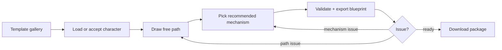

# Novice Canva-Style UI Plan

Goal: make MotionSmith feel like a guided design tool, not an engineering console.
The user should understand the next action in 5 seconds: pick a template or
character, draw a free path, choose a mechanism, export a blueprint.

This is not a Canva integration. “Canva-style” means template-first, visual,
low-friction, and reversible. Every template must create real `ProjectState`,
paths, mechanisms, and blueprint output; no mock screens.

## Visual thesis

A calm MotionSmith-style canvas studio: one large working canvas, one blue-violet primary action, plain-language helpers, and advanced controls hidden until needed.

- Reference: `https://alansynn.com/motionsmith/` for the light CHI/project-page palette and restrained editorial spacing.
- Surface: white canvas, `#f7f8fb` soft background, `#e5e8f0` / `#d6dbe8` lines, restrained shadows.
- Accent: `#5a6cff` for the single next action; near-black `#1b1f28` for structure.
- Density: default screen shows only what a novice needs now.
- Advanced data stays available, but behind `details` panels or inspector tabs.

## Content plan

1. **Start from template**: visual template gallery with sample outcomes.
2. **Draw motion**: one selected part, one free path tool, live point count.
3. **Choose mechanism**: recommended mechanism cards with “good for” copy.
4. **Assemble blueprint**: validation, board preview, download package.

## Interaction thesis

- Drag-to-create before numeric editing: free path is the primary input.
- Progressive disclosure: show “why/next” first, show parameters second.
- Reversible edits: clear path, undo-like replace path, disable mechanism,
  return-to-fix links from validation.

## Novice workflow map

## Screen contracts

### 1. Template gallery / Character Selection

**Primary novice question:** “What can I make?”

Default layout:

- left: product name and one-line promise;
- center/right: 3-5 large template tiles;
- bottom/secondary: Load package, Run ONNX, Import project.

Template tiles:

| Template | What it teaches | Real data created |
| --- | --- | --- |
| Waving arm | path on one limb + four-bar | sample character, right-arm path, one mechanism |
| Bobbing head | short cyclic path + cam/piston option | head path, recommended mechanism |
| Walking legs | two paths + duplicated mechanism instances | leg paths, two mechanisms |
| Blank character | user-loaded asset flow | package review, no fake mechanisms |

Rules:

- No template may be a screenshot-only mockup.
- A template is valid only if it can be saved, reopened, animated, and exported.
- Plain character load must clear stale mechanisms unless user chose replacement.

Implementation target:

- Reuse `createSampleProject()` pattern for starter templates.
- Store tiny template metadata in code first; move to JSON only when there are
  enough templates to justify it.
- Keep “Run ONNX” and package loading as secondary actions, not removed.

### 2. Path Editor

**Primary novice question:** “How do I tell this part where to move?”

Default layout:

- big canvas first;
- floating canvas hint: selected part + current point count;
- right panel: `Free path`, part selector, `Draw free path`, `Clear path`,
  `Next: choose mechanism`;
- advanced panels: path timing/tracking and part/skeleton setup.

Required behavior:

- Drawing is hold-and-drag anywhere on the canvas.
- Starting a stroke on an existing point still draws; point handles must not
  intercept draw mode.
- Point editing is available only when draw mode is off.
- Short or missing path warnings use plain language.
- A valid path enables the next action to Mechanism Foundry.

Copy standard:

- Good: “Choose a body part, press Draw free path, then hold and drag.”
- Bad: “Edit motion vectors and timed samples.”

Current status:

- The app already has the novice free-path panel and drag-based drawing.
- Keep improving visual polish, but do not re-expand the default inspector.

### 3. Mechanism Foundry

**Primary novice question:** “Which mechanism should I use?”

Default layout:

- left: animated preview path and selected mechanism sketch;
- right: recommended mechanism cards before raw parameters;
- each mechanism explains: “good for”, “what it does”, “watch out for”.

Recommended cards:

| Card | Novice label | Explanation |
| --- | --- | --- |
| Four-bar linkage | Best first choice | Turns rotation into a limb swing. |
| Cam follower | Bumps and lifts | Good for bobbing head/props. |
| Piston / slider | Push-pull | Good for straight movement. |
| Gear train | Spin transfer | Good for linked rotation, not path drawing. |

Rules:

- Show one recommendation as primary; do not make users compare every parameter.
- Preserve advanced numeric controls, but below the recommendation.
- Export must create one real mechanism instance with stable id and target part/path.

### 4. Mechanism Design

**Primary novice question:** “Is the mechanism attached and moving correctly?”

Default layout:

- canvas: character, path, mechanism, trace;
- right panel top: selected mechanism summary and status;
- then target part/path selectors;
- then advanced parameters.

Required novice affordances:

- show target part and target path in human labels;
- show warning if mechanism is disabled, partial-range, or detached;
- provide “Fit path” as the primary repair action;
- keep duplicate mechanisms distinct by instance id.

### 5. Blueprint Export

**Primary novice question:** “Can I build it?”

Default layout:

- validation status first: Ready / Needs fix;
- board preview second;
- downloads third;
- detailed recipe last.

Required behavior:

- Every warning links back to the screen that fixes it.
- Output is generated from current project state, never canned guide templates.
- Duplicate mechanism types produce separate recipes.
- The default export format follows Options.

## UI component rules

Use fewer components, but make each one obvious.

| Component | Purpose | Avoid |
| --- | --- | --- |
| Template tile | Start from an outcome | dense stats, fake screenshots |
| Primary action button | One next action per screen | multiple competing filled buttons |
| Canvas hint | orientation while working | long help text |
| Recommendation card | plain mechanism sensemaking | raw parameter tables first |
| Advanced panel | hide expert controls | removing expert controls entirely |
| Validation row | explain fix and destination | generic “invalid” errors |

## Copy rules

- Use verbs: Load, Draw, Choose, Fit, Export.
- One sentence per helper block.
- Prefer body-part names over internal ids.
- Mention ids only in advanced/debug contexts.
- Every warning should say what to do next.

Examples:

- “Draw at least 3 points before choosing a mechanism.”
- “This mechanism only has a partial safe rotation; export still works, but the
  valid range is shown.”
- “No path for Head yet. Draw a path or choose another part.”

## Implementation sequence

1. **Lock current novice path behavior**
   - Keep the existing free path e2e tests.
   - Add only missing browser tests before changing UI flows.

2. **Template gallery**
   - Add minimal template metadata: id, title, beginner promise, thumbnail style,
     factory function.
   - Reuse existing sample project factories; do not add a template engine yet.
   - First templates: Waving arm and Blank character.

3. **Path Editor polish**
   - Keep canvas-first layout.
   - Replace technical labels in default view.
   - Make selected part/path status readable without opening advanced panels.
   - Preserve existing advanced skeleton/path controls behind disclosure.

4. **Mechanism recommendation cards**
   - Move mechanism sensemaking above parameter controls.
   - Mark one recommended option for the current path/part.
   - Keep parameters unchanged underneath.

5. **Blueprint repair links**
   - Convert validation rows into “issue + fix screen” actions.
   - Keep existing export package generation untouched.

6. **Visual QA pass**
   - Browser screenshot at 1440x900 and mobile-ish width.
   - Check first screen has one dominant action.
   - Check novice path drawing can be understood without reading docs.

## Acceptance tests

Browser tests must cover:

- template gallery loads a real starter project;
- blank character/package flow still works;
- free path drag creates points, including when starting over an existing point;
- valid path enables “Next: choose mechanism”;
- mechanism recommendation exports one real instance;
- design screen preserves target part/path;
- blueprint export creates real package files and per-instance recipes;
- validation issues route back to Path Editor or Mechanism Design.

Manual visual checks:

- First-time user can identify the next action in 5 seconds.
- Default screens do not expose raw parameters before the user needs them.
- Advanced users can still reach skeleton, timing, and numeric controls.

## Non-goals

- No cloud template marketplace.
- No Canva API dependency.
- No new design system package.
- No new template DSL until simple code factories become painful.
- No hiding of fabrication/validation errors for the sake of simplicity.

## Done definition

This redesign is done when:

1. a novice can start from template or package, draw a free path, pick a
   mechanism, and export a blueprint without opening advanced panels;
2. all outputs come from real project state;
3. advanced controls still exist behind disclosure;
4. browser tests cover the complete novice path;
5. visual review confirms the UI is calm, clear, and not tool-dense.
