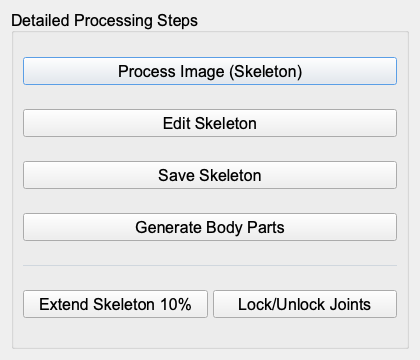

# UI Screenshot Index

Capture environment: `QT_QPA_PLATFORM=offscreen uv run python ui-to-web/tools/capture_ui_screenshots.py`
Purpose: preserve the real Qt runtime layout, tab composition, panel density, button placement, and grid/canvas positions as references for the web rebuild.

| Screenshot | UI state | Main reference points |
| --- | --- | --- |
|  | Character Selection tab | Left input/recognition/view/character/output panels plus right ImageProcessingView canvas/grid |
|  | Path Editor tab | Left Parts/Motion Path/Animation/View Controls plus right EditorView canvas/grid |
|  | Mechanism Design tab | Left mechanism parts/generation/animation/blueprint/view controls plus right canvas/grid |
|  | Mechanism Foundry gallery | GalleryView card-based mechanism selection screen |
|  | Options dialog | Appearance/Simulation/Performance/Workflow/Fabrication/Grid settings |
|  | ProcessingStepsGroup | Detailed processing button group |
|  | CharacterSelectionDialog | Preset character selection dialog |
|  | Manual Segmentation Editor | Part layer radios, skeleton point/layer add/remove, segmentation action buttons |
|  | Custom Coupler Path dialog | slider + numeric spinbox + OK/Cancel |
|  | Recommendation dialog empty state | Recommendation grid, placeholder, and Close layout |

Original capture log: [`screenshots/capture-results.md`](screenshots/capture-results.md)
