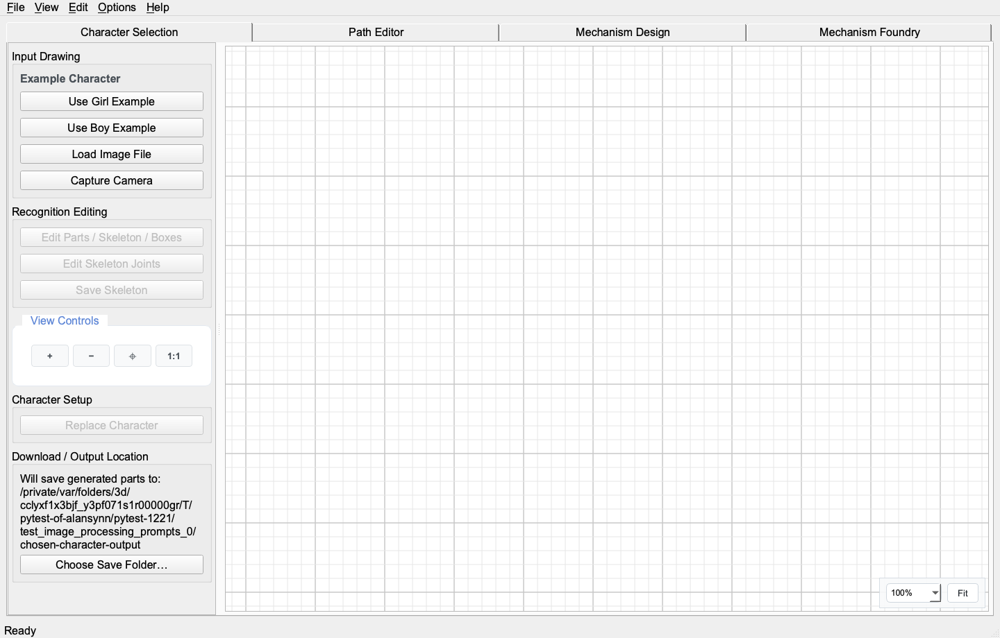
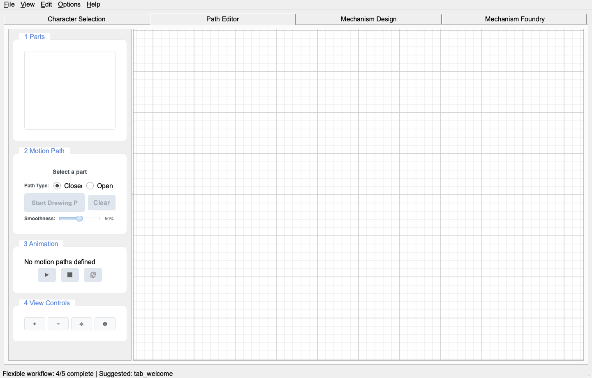
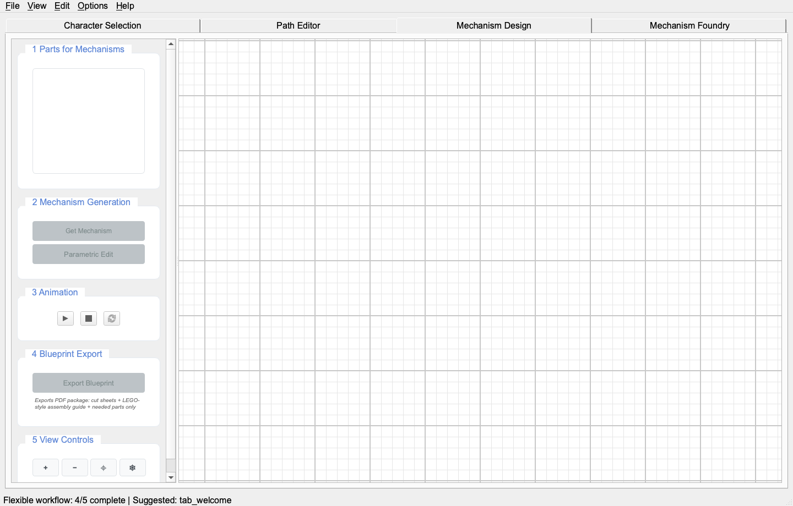
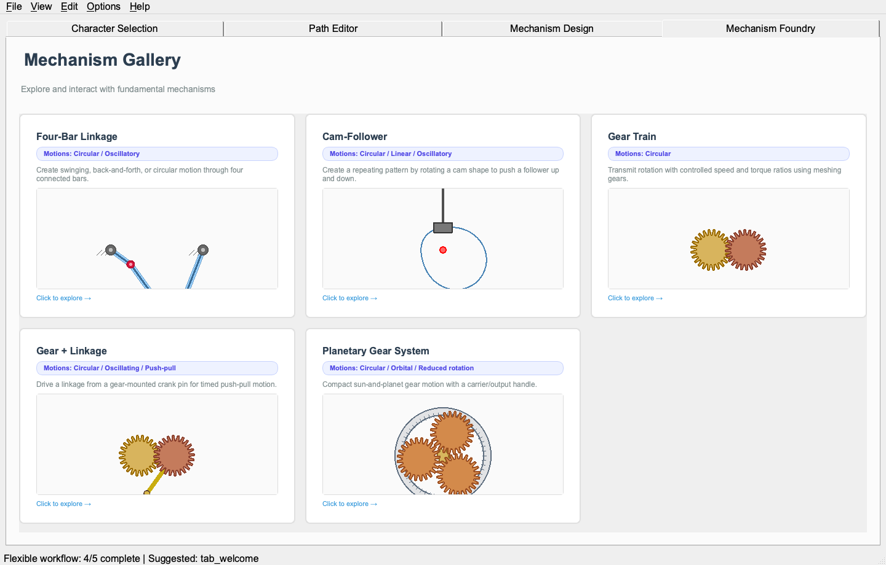
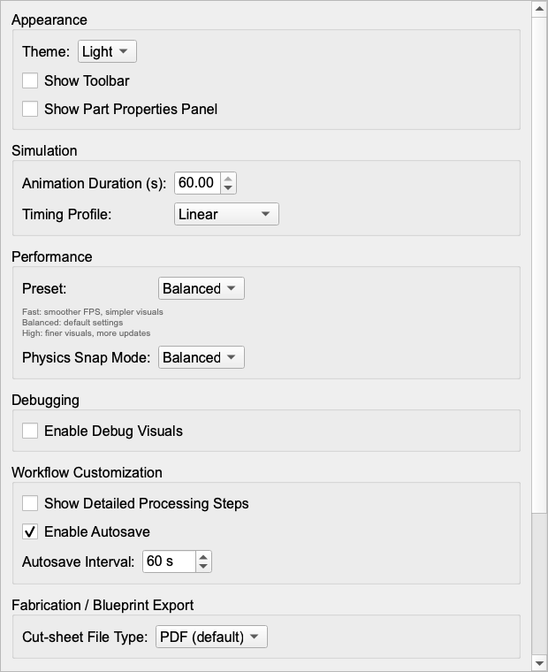
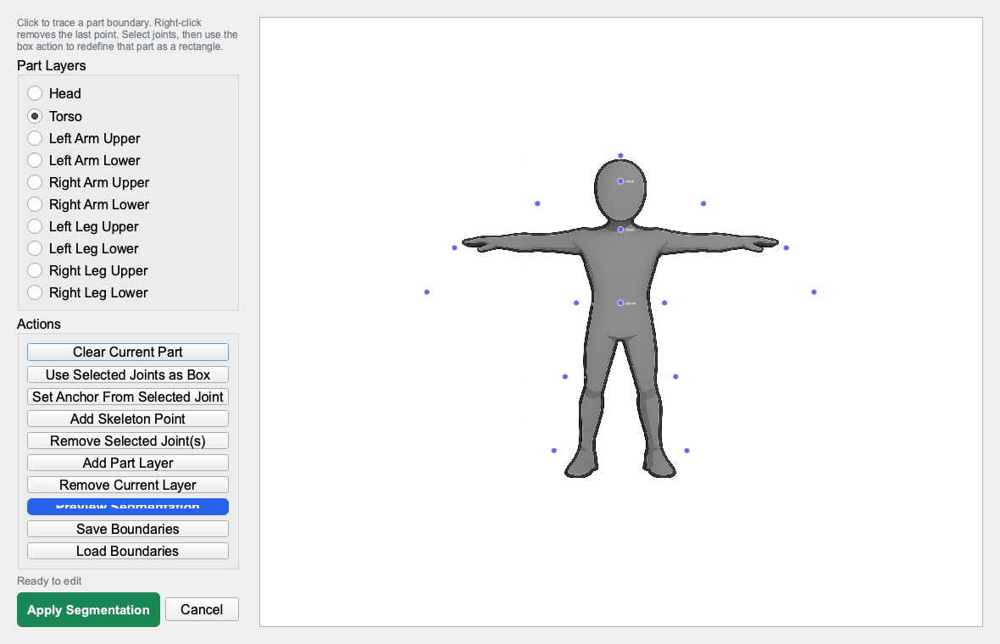
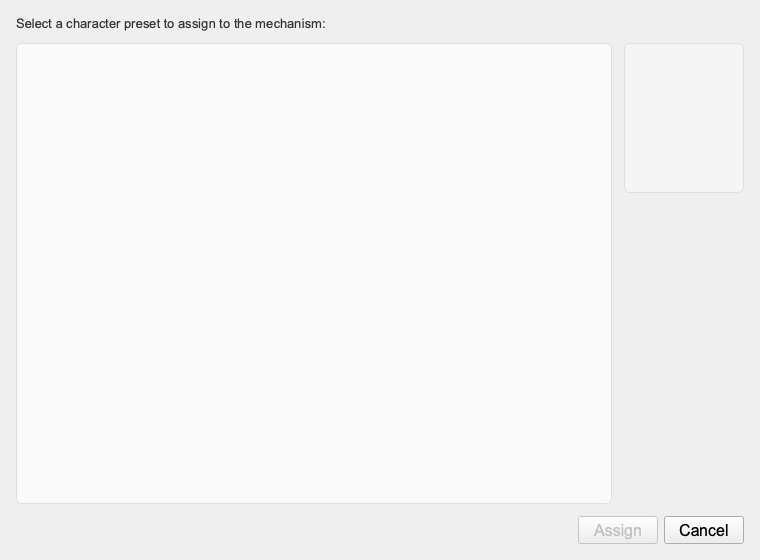
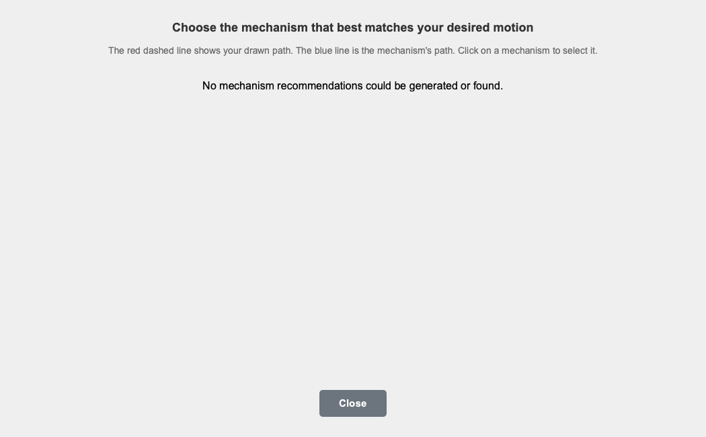
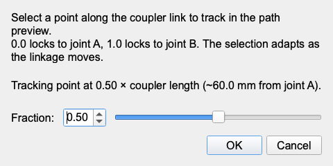

# Automataii UI → Web Port Specification

이 문서는 `src/automataii/presentation/qt/`의 PyQt6 UI를 재귀적으로 훑어서 웹 리빌드에 필요한 화면/탭/버튼/다이얼로그/그리드/캔버스 구성을 정리한 것입니다.

## 0. Inspection evidence

- 자동 스캔 범위: `src/automataii/presentation/qt/**/*.py`
- 스캔 파일 수: 226
- UI-ish class 수: 193
- UI constructor/property call 수: 730
- 자동 인벤토리: [`inventory/qt_ui_inventory.md`](inventory/qt_ui_inventory.md), [`inventory/qt_ui_inventory.json`](inventory/qt_ui_inventory.json)
- UI 소스 파일 인덱스: [`inventory/source-files.md`](inventory/source-files.md)
- 런타임 스크린샷: [`SCREENSHOT_INDEX.md`](SCREENSHOT_INDEX.md)

## 1. Product-level shell

### Current Qt implementation

Source: `src/automataii/presentation/qt/main_window.py`

- Class: `AutomataDesigner(QMainWindow)`
- Window title: `AppConfig.APP_NAME`
- Initial size: `1200 × 680`; minimum `800 × 600`
- Central widget: vertical layout containing a single `QTabWidget`
- Main tab object name: `mainTabWidget`
- Tab bar: custom `ScrollableTabBar`
- Menubar: managed by `ActionManager`
- Toolbar: `Main Toolbar`, object name `mainToolbar`, hidden by default
- Status bar: initialized with `Ready`

### Main tabs

| Order | Object name | Title | Tooltip | Source |
| ---: | --- | --- | --- | --- |
| 0 | `tab_character_selection` | `Character Selection` | choose sample drawings or load image | `ImageProcessingTab` |
| 1 | `tab_path_editor` | `Path Editor` | draw motion paths on character parts | `EditorTab` |
| 2 | `tab_mechanism_design` | `Mechanism Design` | attach and tune mechanisms | `MechanismDesignTab` |
| 3 | `tab_mechanism_foundry` | `Mechanism Foundry` | simulate linkage/cam/gear mechanisms | `MechanismFoundryView` |
| modal | `tab_options` inside `optionsDialog` | `Options` | app options/settings | `OptionsTab` |

Experiment mode title prefix exists (`1.`, `2.`, `3.`), and Foundry is hidden in experiment mode.

### Web shell recommendation

- Do **not** create separate canvases per route/tab.
- Use one persistent center canvas and route-specific side panels.
- Preserve current visible top-level navigation labels for user continuity.
- Treat Options as modal drawer/dialog over same app state.
- Keep status bar as bottom status/toast channel. It currently communicates workflow sequence, errors, save/export status.

## 2. Main menu and toolbar

Source: `src/automataii/presentation/qt/actions/action_manager.py`

### Menus

| Menu | Actions |
| --- | --- |
| File | New, Load Project..., Recover Browser Autosave..., Download Snapshot, Download Snapshot As..., Export Blueprint Package, Download Portable Copy |
| View | Zoom In, Zoom Out, Zoom to Fit, Reset View, Save Workspace Layout, Restore Workspace Layout, Reset Workspace Layout |
| Edit | Back (Undo), Forward (Redo) |
| Options | Preferences... |
| Help | Keyboard Shortcuts, About... |

### Toolbar

Toolbar actions: New, Load Project, Download Snapshot, Export Blueprint Package, Download Portable Copy. Hidden by default; Options can show/hide it.

### Web mapping

- Top app bar: File/View/Edit/Options/Help menus or command palette.
- Toolbar: optional compact quick-action row, hidden by default to match Qt behavior.
- Keyboard shortcuts to preserve:
  - Open: platform open shortcut
  - Save: platform save shortcut
  - Save As
  - Quit
  - Zoom in: `Ctrl/Cmd + +`
  - Zoom out: `Ctrl/Cmd + -`
  - Zoom fit: `Ctrl/Cmd + 0`
  - Undo/Redo: platform undo/redo + `Ctrl+Y`, `Ctrl+Shift+Z` fallback.

## 3. Character Selection tab

Screenshot: 

Source: `src/automataii/presentation/qt/tabs/image_processing_tab.py`

### Layout

- Horizontal splitter.
- Left scrollable control panel, min ~220, max ~440, initial ~300.
- Right panel with `ImageProcessingView` canvas and floating bottom-right zoom toolbar.

### Left panel groups and controls

| Group | Controls | Notes |
| --- | --- | --- |
| Input Drawing | `Use <Sample> Example` buttons, `Load Image File` | sample buttons generated from example images, limited to 2 in current code; browser hardware capture was removed |
| Processing Steps | `Process Image (Skeleton)`, `Edit Skeleton`, `Save Skeleton`, `Generate Body Parts`, plus optional `Extend Skeleton 10%`, `Lock/Unlock Joints` | implemented by `ProcessingStepsGroup`; detailed steps can be hidden/shown |
| Recognition Editing | `Edit Parts / Skeleton / Boxes`, `Edit Skeleton Joints`, `Save Skeleton` | opens manual segmentation/skeleton editing surfaces |
| View Controls | `+`, `−`, `⌖`, `1:1` | zoom in/out/fit/reset |
| Character Setup | `Replace Character` | assigns processed image as current character |

`Choose Save Folder…` is intentionally retired from the browser UI: current exports use normal browser downloads, so a directory picker would be misleading until a native/Tauri writer owns the output path.

### Right canvas

Source: `src/automataii/presentation/qt/image_view.py`

- Class: `ImageProcessingView(QGraphicsView)`
- Draws background grid in `drawBackground`.
- Grid default enabled.
- Default pitch from `DEFAULT_GRID_CELL_CM` = 2 cm / 20 mm.
- Supports image pixmap, debug bounding boxes, skeleton lines/joints/labels, guides.
- Uses `ViewportController` for pan/zoom/camera state.
- Floating controls: zoom combo values `50%, 75%, 90%, 100%, 125%, 150%, 200%`, plus `Fit`.

### Web mapping

- Panel: `CharacterPanel` with groups matching above.
- Canvas layers: `source.image`, `skeleton.bonesJoints`, `overlays.debugStatus`, `grid`.
- Floating zoom control should become a reusable `CanvasZoomToolbar`.
- Manual edit launch opens `ManualSegmentationDialog`.

## 4. Path Editor tab

Screenshot: 

Source: `src/automataii/presentation/qt/tabs/editor/tab.py` and `tabs/editor/components/ui_builder.py`

### Layout

- Horizontal splitter.
- Left control panel with scroll area.
- Right `EditorView(QGraphicsView)` canvas.
- Splitter initial sizes roughly `[300, 900]`.

### Controls

| Group | Controls | Behavior |
| --- | --- | --- |
| `1 Parts` | `QListWidget` of character parts | select active body part; tooltip asks user to select then start drawing path |
| `2 Motion Path` | status label `Select a part`; radio `Closed`/`Open`; `✏️ Start Drawing Path`; `Clear`; info label; `Smoothness` slider 0–100 with value label | draw/edit path for selected part; closed default |
| `3 Animation` | status label; play/stop/reset icon buttons | IK animation playback from path data |
| `4 View Controls` | `+`, `−`, `⌖`, `⎈` | zoom in/out/fit/center character |

### Editor canvas

Source: `src/automataii/presentation/qt/views/editor_view.py`

- Class: `EditorView(QGraphicsView)`
- Background grid via `drawBackground` with cached minor/major paths.
- Character part items are `CharacterPartItem` with z index around `Z_PART_DEFAULT = 10`.
- Skeleton overlay item uses `Z_SKELETON_OVERLAY = 50` in editor context.
- Motion path drawing and path vertex editing are delegated to components.
- Drag modes change by interaction mode: selection/rubber-band, path drawing, joint definition, skeleton edit, panning.

### Web mapping

- Panel: `PathEditorPanel`.
- Canvas layers: `character.parts`, `skeleton.bonesJoints`, `motion.path.final`, `motion.path.preview`, `handles.pathVertices`.
- Path data must be stored per part in project state, not inside canvas node only.
- Smoothness should be deterministic and update visual path and stored params from same source.

## 5. Mechanism Design tab

Screenshot: 

Sources:

- `src/automataii/presentation/qt/tabs/mechanism_design/tab.py`
- `mechanism_design_ui.py`
- `mechanism_design_tab_layout.py`
- `controllers/*`, `services/*`, `components/*`
- `src/automataii/presentation/qt/tabs/parametric_editing_manager.py`
- `src/automataii/presentation/qt/parametric/components/*`

### Layout

- Left scrollable panel, fixed width around 300.
- Right mechanism canvas/view.
- Same visual language as Editor tab.

### Controls

| Group | Controls | Notes |
| --- | --- | --- |
| `1 Parts for Mechanisms` | `mechanism_layers_list` | black/gray state indicates path availability; selects mechanism target layer/part |
| `2 Mechanism Generation` | `Get Mechanism`, `Assign Character`, `Parametric Edit` | recommendation, dummy/character assignment, handle-based parameter editing |
| `3 Animation` | play/stop/reset icon buttons | mechanism/character animation playback |
| `4 Blueprint Export` | `Export Blueprint` + explanatory label | exists in `mechanism_design_tab_layout.py`; captured UI shows it in current app |
| `5 View Controls` | `+`, `−`, `⌖`, `⎈` | zoom/fit/center character |

### Current complexity hotspots

These are especially important for web rebuild because user reported mismatches here.

| Concern | Current implementation area | Web requirement |
| --- | --- | --- |
| Mechanism layer data | `mechanism_layers: dict[str, dict]` across tab/services | make `MechanismInstance` typed and globally stored |
| Visual item lifecycle | `VisualItemManager`, `SceneManagementService`, direct scene add/remove | one scene graph diff; no orphan handles/items |
| Transform calculation | `SceneTransformManager`, anchor/scale/rotation in layer data | canonical transform in mm; viewport transform separate |
| Parametric handles | `parametric_editing_manager.py`, `parametric/components/*`, `handles/rotation_handle.py` | handle position = direct projection from canonical params, not duplicated mutable display state |
| Foundry ↔ Design sync | `foundry_scene_contract.py`, main window sync wiring | importing Foundry mechanisms must preserve board position, anchor, type, params, output point, valid angle range |
| Blueprint export | `blueprint/exporter.py`, `mechanisms/blueprint/*` | export reads canonical scene state; no generic fallback if instance state exists |

### Web mapping

- Panel: `MechanismDesignPanel`.
- Canvas layers: `character.parts`, `skeleton`, `motion.paths`, `mechanism.instances`, `mechanism.traces`, `handles.parametric`, `blueprint.fabrication`.
- `Parametric Edit` should not create independent state. It toggles `handles.parametric.visible/editable` and updates the canonical `MechanismInstance.parameters` immediately.
- If a mechanism cannot solve a full 360°, represent `validAngleRange` and draw/scrub only the valid range. Do not block display of partially valid mechanisms.

## 6. Mechanism Foundry tab

Screenshot: 

Source: `src/automataii/presentation/qt/tabs/mechanism_foundry/foundry_view.py` plus gallery/info widgets.

### States

The tab uses a `QStackedWidget`:

1. `GalleryView` — card grid of mechanisms.
2. Editor widget — toolbar + controls panel + graphics view + optional sensemaking panel.

### Gallery screen

Sources: `gallery_view.py`, `gallery_thumbnail.py`

- Title: `Mechanism Gallery`
- Subtitle: `Explore and interact with fundamental mechanisms`
- Cards show preview, title, motion summary, description, click hint `Click to explore →`.

### Foundry editor toolbar

| Toolbar action | Type | Behavior |
| --- | --- | --- |
| `← Back to Gallery` | action | return to gallery |
| `▶ Play` | checkable | toggle animation |
| `🔧 Forces` | checkable default on | show force vectors |
| `➡ Velocity` | checkable default off | show velocity vectors |
| `〰 Trail` | checkable default off | show trail |
| `🔍 Path Preview` | checkable default on | show path preview |
| `🧠 Show Sensemaking` | checkable default off | show/right info panel |
| `🔄 Reset` | action | reset animation |
| `📤 Add to Mechanism Tab` | action | export current configuration to Mechanism Design |

### Foundry editor controls

| Group | Controls |
| --- | --- |
| Mechanism Selection | mechanism `QComboBox` |
| Parameters | generated sliders + value labels from current mechanism spec |
| Animation | `Angle:` label, horizontal angle slider, `Valid Range:` combo, `Motion Point:` combo |
| Display Options | `Motions:` label, `Status:` safety label |

### Foundry canvas/grid

- Class uses separate `QGraphicsScene/QGraphicsView`.
- Draws grid and axes with low z-values around -99.
- Fabrication board/hole overlay around z -97.
- Mechanism items z ~5–21 depending family.
- Uses physical context: grid enabled, grid cell cm, pitch choice, physical profile.
- Snaps parameter values to physical kit constraints where enabled.

### Web mapping

- Foundry should become a route/panel preset over the same scene store.
- Gallery can remain non-canvas card grid.
- When entering Foundry editor, either:
  - use the same canvas with only `foundry.preview` visible, or
  - use an isolated preview scene but export must serialize exact canonical params into global scene.
- `Add to Mechanism Tab` must create a `MechanismInstance` with unique id every time, even if mechanism type repeats.

## 7. Options dialog

Screenshot: 

Source: `src/automataii/presentation/qt/tabs/options_tab.py`, opened by `AutomataDesigner.show_options_dialog()`.

### Groups and controls

| Group | Controls |
| --- | --- |
| Appearance | Theme combo `Light/Dark`; `Show Toolbar`; `Show Part Properties Panel` |
| Simulation | animation duration spinbox 0.1–60s; timing profile combo `Linear/Ease-In/Ease-Out/Ease-In-Out` |
| Performance | preset combo `Fast/Balanced/High`; help label; physics snap mode combo `Fast/Balanced/High` |
| Debugging | `Enable Debug Visuals` |
| Workflow Customization | `Show Detailed Processing Steps`; `Enable Autosave`; autosave interval spinbox |
| Fabrication / Blueprint Export | cut-sheet file type combo `PDF (default)/SVG` |
| Fabrication Presets & Display Units | grid unit combo `cm/inch/px`; `Fabrication-ready preset mode`; board pitch combo; read-only grid cell size spinbox |

### Web mapping

- Modal dialog or right settings drawer.
- Store options in a single app settings slice.
- Grid/physical context updates must dispatch to scene state immediately and should invalidate snap caches/blueprint previews.

## 8. Dialog inventory

### Manual Segmentation Editor

Screenshot: 
Source: `src/automataii/presentation/qt/interactive_segmentation_editor.py`

Controls:

- `Part Layers` group with generated body-part radio buttons.
- `Actions` group:
  - `Clear Current Part`
  - `Use Selected Joints as Box`
  - `Set Anchor From Selected Joint`
  - `Add Skeleton Point`
  - `Remove Selected Joint(s)`
  - `Add Part Layer`
  - `Remove Current Layer`
  - `Preview Segmentation`
  - `Save Boundaries`
  - `Load Boundaries`
  - status label
  - `Apply Segmentation`
  - `Cancel`
- Canvas: `ClickableGraphicsView`, image, rectangles/boxes, skeleton selectable joints.

Web mapping:

- This is effectively a specialized editor mode. It can be a modal with an embedded mini canvas, or better: use the persistent canvas with a modal side panel and temporary layer preset.
- Must support adding/removing skeleton points and part layers, as requested by user in prior turns.

### Character Selection Dialog

Screenshot: 
Source: `dialogs/character_selection_dialog.py`

- Title: `Select Character`
- Header: `Select a character preset to assign to the mechanism:`
- List widget + thumbnail + description.
- OK/Cancel button box.

### Mechanism Recommendation Dialog

Screenshot: 
Source: `dialogs/recommendation_dialog.py`

- Title: `Mechanism Recommendations`
- Instruction: `Choose the mechanism that best matches your desired motion`
- Subtitle explains red dashed user path vs blue mechanism path.
- Scrollable grid layout, 3 columns.
- `PreviewContainer` cards include mechanism type/name, match percentage, preview, `Apply this`.
- Empty placeholder says `No mechanism found` or no recommendations.
- Close button.

Web mapping:

- Use a modal/sheet with preview cards.
- Each recommendation must carry full mechanism payload, including type, params, key points, reverse direction, fabrication readiness, valid angle range.
- Applying one recommendation creates/updates a mechanism instance; preview click only selects/highlights.

### Browser hardware capture

Dropped from the web port. Character import now uses bundled starters, project/package import, or local image upload with Web ONNX.

### Custom Coupler Point Dialog

Screenshot: 
Source: `tabs/mechanism_foundry/dialogs/custom_coupler_dialog.py`

- Title: `Custom Coupler Path`
- Description text about selecting a point along coupler link.
- Slider + numeric spinbox for `Fraction:`.
- OK/Cancel.

## 9. Grid, sheet, and fabrication UI

### Current sources

- Defaults: `automataii.shared.physical_kit.DEFAULT_GRID_CELL_CM`
- Image grid: `src/automataii/presentation/qt/image_view.py`
- Editor grid: `src/automataii/presentation/qt/views/editor_view.py`
- Foundry grid/board: `src/automataii/presentation/qt/tabs/mechanism_foundry/foundry_view.py`
- Options controls: `src/automataii/presentation/qt/tabs/options_tab.py`
- Main propagation: `main_window.py` around physical context handling
- Blueprint export: `src/automataii/presentation/qt/blueprint/exporter.py`

### Requirements for web

1. Grid defaults to 2 cm / 20 mm.
2. Letter sheet bounds must be visible where print/fabrication matters.
3. Character scale-to-letter must be stored once and reflected in every tab.
4. Grid rendering must be consistent between Character Selection, Path Editor, Mechanism Design, Foundry, and Blueprint.
5. Fabrication board coordinates must derive from same scene coordinate system, not per-export generic defaults.

## 10. Z-order and layer mapping

Current constants: `src/automataii/config/z_indices.py`

| Qt z constant/value | Meaning | Web layer |
| --- | --- | --- |
| `Z_BACKGROUND_IMAGE = 0` | base image/background | `source.image` |
| `Z_PART_DEFAULT = 10` | character parts | `character.parts` |
| `Z_SKELETON_BONES = 5`, `Z_SKELETON_JOINTS = 6` | skeleton in basic views | `skeleton.bonesJoints` |
| `Z_SKELETON_MECHANISM_BONES = 45`, `Z_SKELETON_MECHANISM_JOINTS = 46` | mechanism tab skeleton | `skeleton.bonesJoints` with style variant |
| `Z_MOTION_PATH_LINE = 20` | saved motion path | `motion.path.final` |
| `Z_ANCHOR_POINT = 35` | anchors | `handles.anchors` |
| `Z_SELECTION_HIGHLIGHT = 40` | part selection | `overlays.selection` |
| `Z_MOTION_PATH_PREVIEW = 45` | currently drawn path | `motion.path.preview` |
| `Z_SKELETON_OVERLAY = 50` | skeleton overlay | `skeleton.bonesJoints` |
| `Z_MECHANISM_PIVOT = 102` | mechanism pivots | `mechanism.instances` / `handles.pivots` |
| `Z_DEBUG_BOUNDING_BOX = 500+` | debug overlays | `overlays.debugStatus` |
| `1000+` direct handles | parametric/path handles | `handles.parametric` |

## 11. Web component decomposition

```text
AppShell
├─ TopMenuBar
├─ OptionalToolbar
├─ WorkflowTabs / RouteTabs
├─ CanvasWorkspace
│  ├─ PersistentSceneCanvas
│  ├─ FloatingZoomToolbar
│  ├─ StatusOverlay
│  └─ LayerDebugOverlay (debug only)
├─ SidePanelSlot
│  ├─ CharacterPanel
│  ├─ PathEditorPanel
│  ├─ MechanismDesignPanel
│  ├─ FoundryPanel / FoundryGallery
│  └─ OptionsDrawer
└─ DialogHost
   ├─ ManualSegmentationDialog
   ├─ RecommendationDialog
   ├─ CharacterPresetDialog
   ├─ CustomCouplerDialog
   ├─ AboutDialog
   └─ File/Save/Export dialogs
```

## 12. State model needed before UI rebuild

Recommended slices:

| Slice | Stores |
| --- | --- |
| `project` | project path, metadata, dirty state, autosave state |
| `assets` | source images, generated part images, ONNX/AI outputs |
| `character` | body parts, masks/bounds, anchors, part layers, scale-to-sheet transform |
| `skeleton` | joints, hierarchy, editable/locked/bend direction metadata |
| `paths` | per-part motion paths, open/closed, smoothness, vertex handles |
| `mechanisms` | instances, type, parameters, anchors, valid angle range, visual sync metadata |
| `animation` | scheduler state, current frame/time, playback speed/duration/timing profile |
| `physicalContext` | grid enabled, pitch, unit, fabrication profile, letter sheet |
| `viewport` | pan/zoom per workspace or global shared camera |
| `ui` | current tab, active tool, selected ids, dialogs, panels, debug flags |

## 13. Migration order

1. Build typed scene/project state independent of rendering.
2. Implement persistent canvas with grid/sheet and viewport controls.
3. Port character image/part/skeleton display.
4. Port Path Editor path draw/edit.
5. Port Mechanism Design instances and parametric handles.
6. Port Recommendation dialog with card previews.
7. Port Foundry gallery/editor and exact Add-to-Mechanism-Design serialization.
8. Port Options and physical context propagation.
9. Port Blueprint/Fabrication preview/export from canonical state.
10. Add regression harness: screenshot snapshots + scene-state snapshots + pointer-drag tests.

## 14. Must-not-regress checklist

- [ ] Switching tabs never loses canvas pan/zoom unless user explicitly resets.
- [ ] Switching tabs never creates duplicate skeleton/path/mechanism items.
- [ ] Character scale and position are identical in Character, Editor, Mechanism, Blueprint.
- [ ] 2 cm grid is identical in every canvas mode.
- [ ] Parametric handle position equals numeric parameter value after every drag.
- [ ] Mechanism drag updates stored parameters and immediate visuals from the same transaction.
- [ ] Mechanism import from Foundry preserves position, board context, type, params, output point, valid angle range.
- [ ] Multiple mechanisms of the same type are stored/rendered/exported as separate instances.
- [ ] Part layers and skeleton points can be added/removed and are reflected in all tabs.
- [ ] Blueprint/assembly guide reads actual scene state, not generic defaults.
